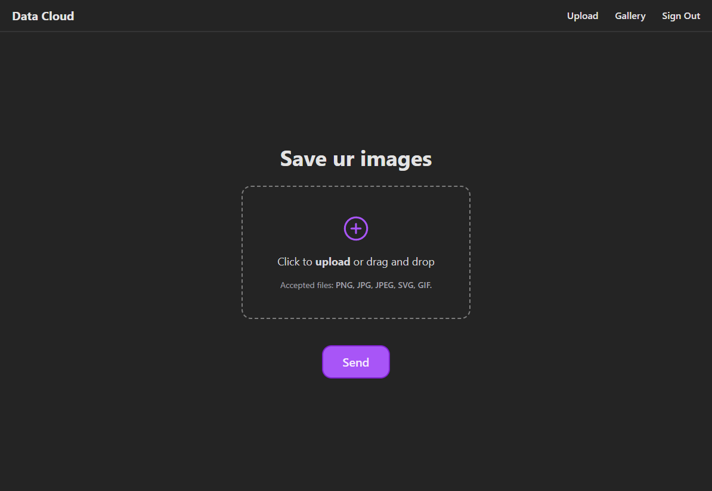

<h1 align="center">Título</h1>

[Projeto](#projeto)
&nbsp;&nbsp;&nbsp;|&nbsp;&nbsp;&nbsp;
[Tecnologias](#tecnologias)
&nbsp;&nbsp;&nbsp;|&nbsp;&nbsp;&nbsp;
[Licença](#license)

  

 

 
 

## 💻 Projeto 

Nesse projeto o objetivo era criar um bucket no supabase e fazer o envio de imagens para a nuvem.

Fiz a autenticação da aplicação e ela segue um modelo de galeria, podendo fazer upload de imagem, visualização e exclusão.

 
 

## 🚀 Tecnologias 

- TypeScript
- Vite
- React
- React Router
- React Spinners
- Supabase
- Tailwind
- Phosphor Icons

 
 

## 🔒 Licença

Esse projeto está sob a licença MIT.

